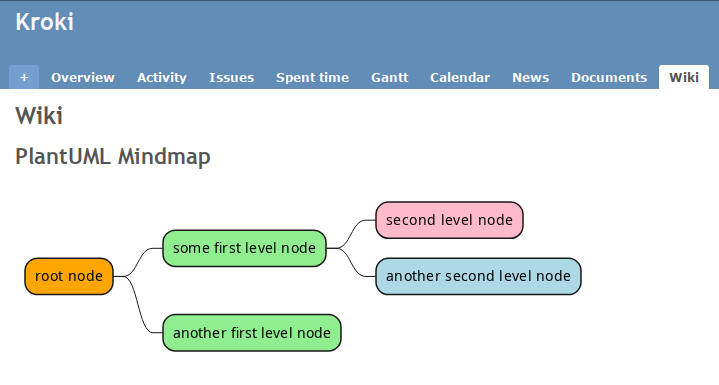

# Redmine-Kroki Plugin

This plugin renders plain text diagrams to images in Redmine issues and
wiki pages.



## Features

* 📊 Renders 30+ diagram types including Mermaid, PlantUML, BPMN, Excalidraw and
  Draw.io/Diagrams.net (experimental).
* 🚀 Offloads the rendering of diagrams to external servers. No dependencies
to download.
* 📥 Embeds SVG markup in the page, so it's versioned with at every save and
  there are files to deal with!

## Prerequisites

* A Redmine installation (only v5 tested so far)
* A Kroki server with optional services (Mermaid, BPML, Excalidraw and
  Diagrams.net)

### Suggested setup

The easiest way to get this initial setup is to run your Redmine instance along
with the Kroki servers from a Docker Compose project (you can just include the
[compose.kroki](compose.kroki.yml) file in your existing project). Have
a look at the other compose files in the source code to get you started.

### Other setups

Other options include Podman, Kubernetes, bare metal or external provider. Read
[Kroki documentation](https://docs.kroki.io/kroki/setup/install/) for more
information on how to setup the service. It doesn't really matter how you do it,
just make sure the Kroki server is reachable from your Redmine instance.

## Installation

1. Meet the prerequisites if you haven't done so already.
1. Download a [release](//github.com/JeffDess/redmine-kroki/releases).
1. Extract the archive into the _/plugins_ directory of your Redmine server.
1. Restart your Redmine server.

## Configuration

If you have the suggested setup, then the default configuration should be
working for you.

Otherwise, head to _Administration > Plugins > Redmine-Kroki_ and input your
Kroki server URL, including the protocol (_http://_ or _https://_) and the port
number (typically 8000).

   Examples:

* Docker Compose: `http://kroki:8000`
* Local Kroki server: `http://127.0.0.1:8000`
* External provider: `https://example.com:8000`

## Usage

Input a diagram in a kroki macro and pass the diagram type as an argument.

* Choose from this list of [supported diagram types](https://kroki.io/#support)
  \+ `diagramsnet`
* Enter the diagram type as alpha-numeric lowercase (no spaces or hyphens)

✅ Correct

```markdown
{{kroki(mermaid)
...
}}

{{kroki(c4plantuml)
...
}}

{{kroki(vegalite)
...
}}
```

❌ Incorrect

```markdown
{{kroki
...
}}

{{kroki(C4 PlantUML)
...
}}

{{kroki(vega-lite)
...
}}
```

## Troubleshooting

1. **The page with the macro loads for a long time then I get an
   error.**

   Most likely, the request times out. Check the Kroki URL in the configuration
   and make sure your Kroki server is running. It could also be linked to
   network condition (such as firewall blocking the request or a server ban).

   Test with `curl <Your Kroki URL>/graphviz/svg --data-raw 'digraph G {A->B}'`
   from your Redmine server and it should return a 200 response within a few
   milliseconds.

1. **When I insert a diagram with the macro, I get a 400 error.**

   You have a syntax error in your diagram, the error message should help you
   to spot it. Review your content and try again.

1. **Most diagram types work, except for
   Mermaid/BPMN/Excalidraw/Diagrams.net.**

   The corresponding service is either not installed, not running or unreachable
   from your Kroki server. Check their status and try again.

If you run into other problems, please feel free to [open an issue](//github.com/JeffDess/redmine-kroki/issues/new/choose).

## Development Environment

### Quickstart

**Prerequisite**: Docker and Docker Compose installed

1. Clone this repository
2. Run `docker-compose up`
3. Visit <http://localhost:8080>

### Tests

* Tests can be run with `scripts/test.sh`.
* It will spawn test containers so it won't interfere with your development
  environment.
* These containers will keep running after the test has completed, so invoke
  the command again to rerun it quickly.
* When you are done, run `scripts/test.sh --down` to kill the containers.
